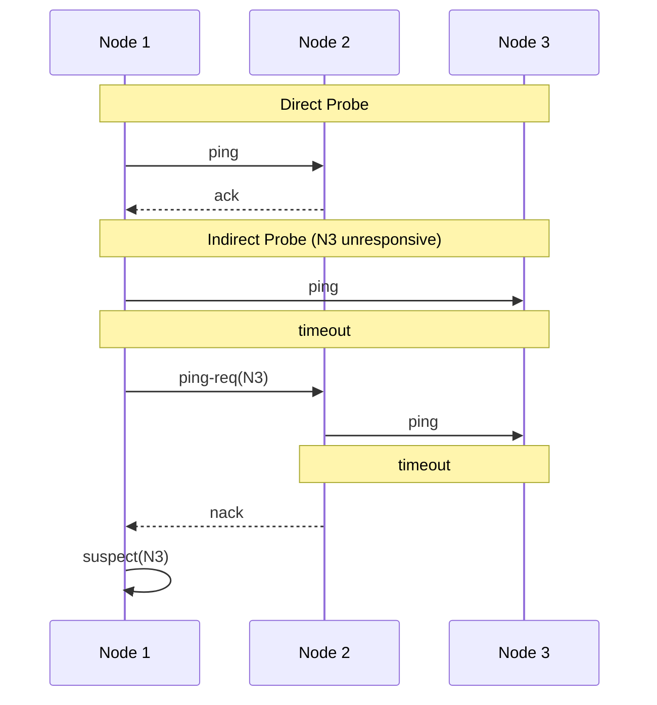
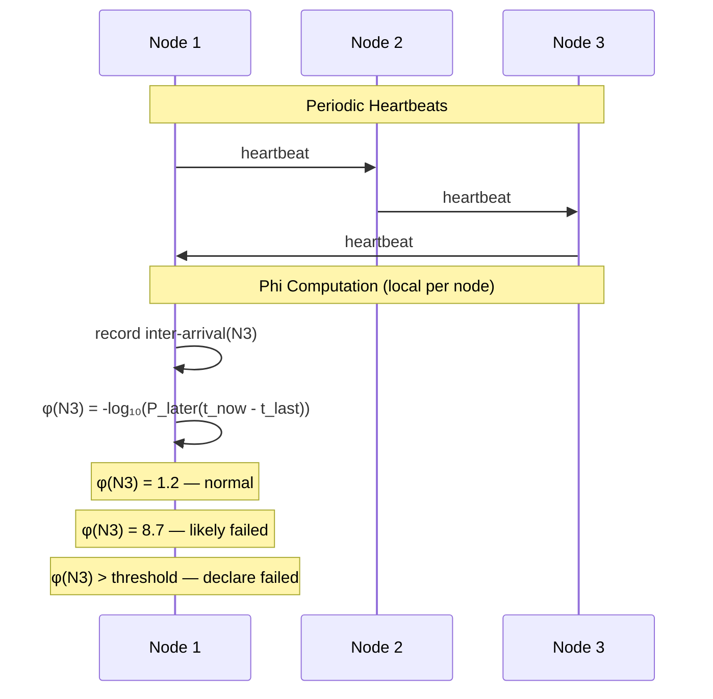
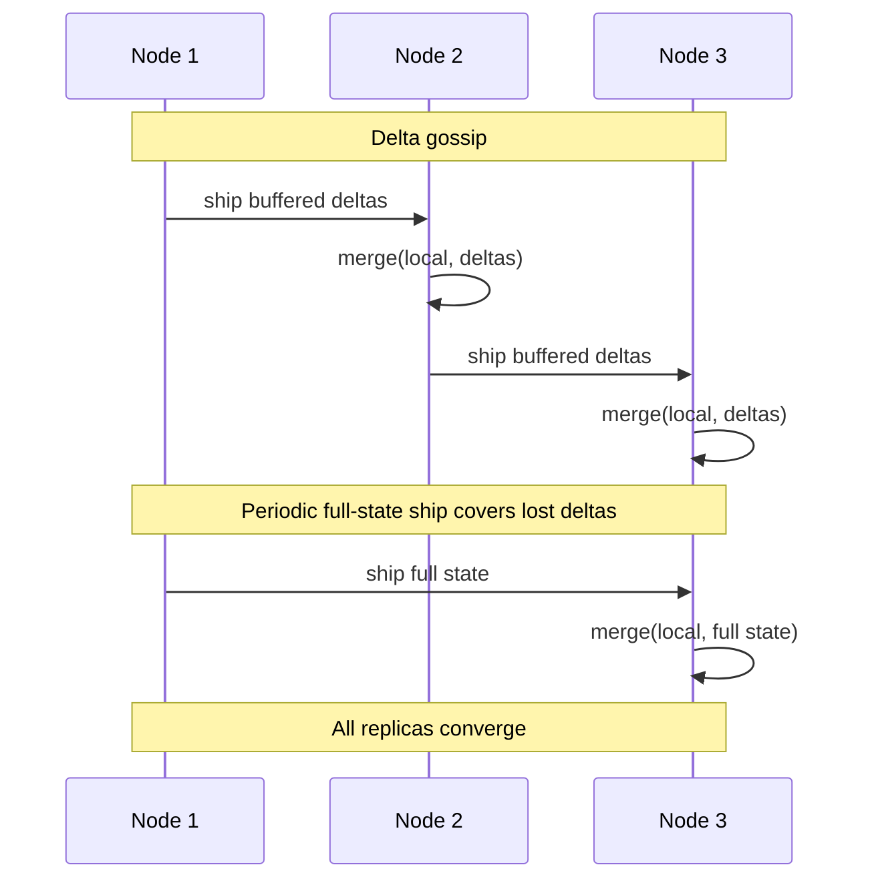
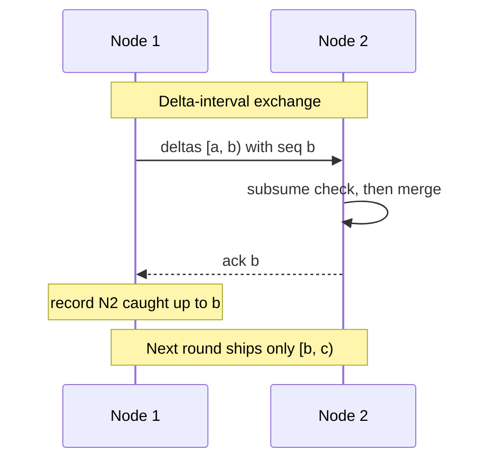

# meld

Gossip, membership, and convergence primitives for distributed systems.

Go library providing gossip transport, membership, and conflict-free replicated data types.

## Packages

| Package              | Implementations                                                                   | Use case                                     |
| -------------------- | --------------------------------------------------------------------------------- | -------------------------------------------- |
| `gossip/`            | `udp`, `tcp`                                                                      | Point-to-point and epidemic gossip transport |
| `membership/`        | `swim`, `phi`                                                                     | Cluster membership and failure detection     |
| `crdt/`              | `gcounter`, `pncounter`, `lwwregister`, `versionvector`, `causalcontext`, `orset` | Conflict-free replicated data types          |
| `antientropy/`       | `basic`, `causal`                                                                 | CRDT convergence                             |
| `store/`             | `memory`, `sqlite`                                                                | Persistence                                  |
| `util/merkle/`       |                                                                                   | Locate divergent keys via hash trees         |
| `util/rendezvous/`   |                                                                                   | Placement and preference lists               |
| `util/tracecontext/` |                                                                                   | Move W3C trace context across the wire       |

## SWIM Failure Detection

SWIM (Das et al., 2002) detects failures via probe-based protocol.
Each node periodically pings a random peer. If no ack arrives, it
requests indirect probes through other members. Binary alive/suspect/dead
decisions with configurable timeouts.

## Phi Accrual Failure Detection

Phi accrual (Hayashibara et al., 2004) outputs a continuous suspicion
level (φ) derived from heartbeat inter-arrival time statistics. The
application chooses its own threshold. Self-tuning — adapts to actual
network conditions without manual timeout configuration.

## Anti-Entropy: Eventual Convergence (`basic`)

Delta-state anti-entropy (Almeida et al., 2018). Each node buffers the
small deltas its own mutations produce and periodically ships them to
random neighbors, or the full state when nothing is buffered. Receivers
merge and re-gossip. Because merge is commutative, associative, and
idempotent, reordered, duplicated, and dropped messages are all harmless,
and the occasional full-state ship covers a delta lost for good. After
enough rounds every replica converges.

No causal consistency: an intermediate state may briefly reflect an
effect before its cause. That is fine whenever only the converged value
matters, the common case for counters and AP workloads.

## Anti-Entropy: Causal Consistency (`causal`)

Causal anti-entropy (Almeida et al., 2018, Section 6.1). Adds per-object
causal consistency on top of convergence: a replica never observes an
effect before its cause. Each node numbers its deltas with a monotonic
sequence counter and ships each neighbor only the contiguous delta-interval
that neighbor has not yet acknowledged, never joining an interval into a
state that does not already subsume the state its first delta was joined
into. Per-neighbor acks track how far each neighbor has caught up, a
durable sequence counter keeps a restarted node from skipping deltas, and
garbage collection drops deltas every neighbor has acknowledged.

Use it when intermediate states are observed and causal order matters.
For workloads that only read the converged value, `basic` is simpler and
sufficient.

