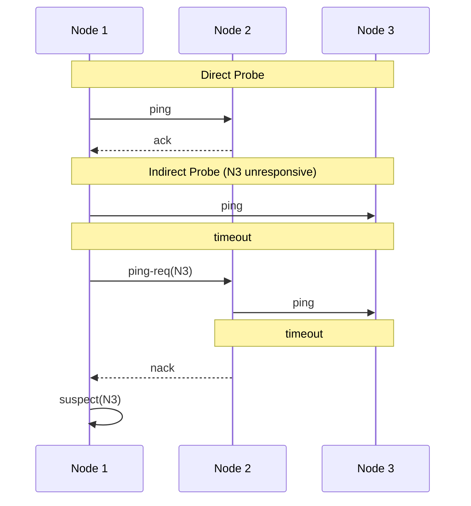
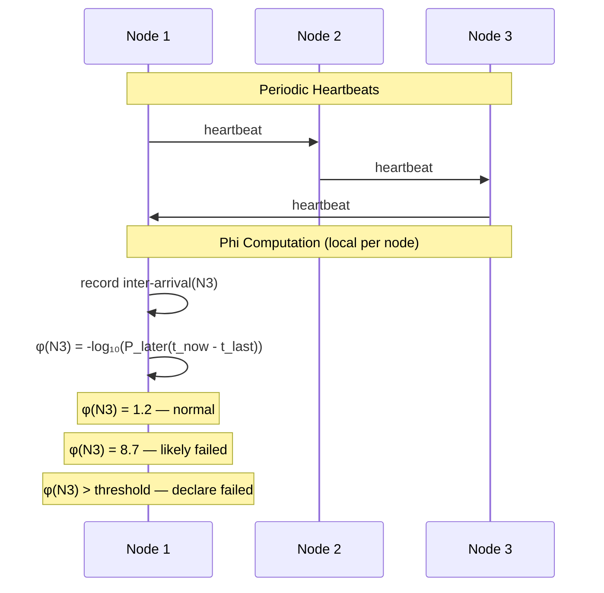
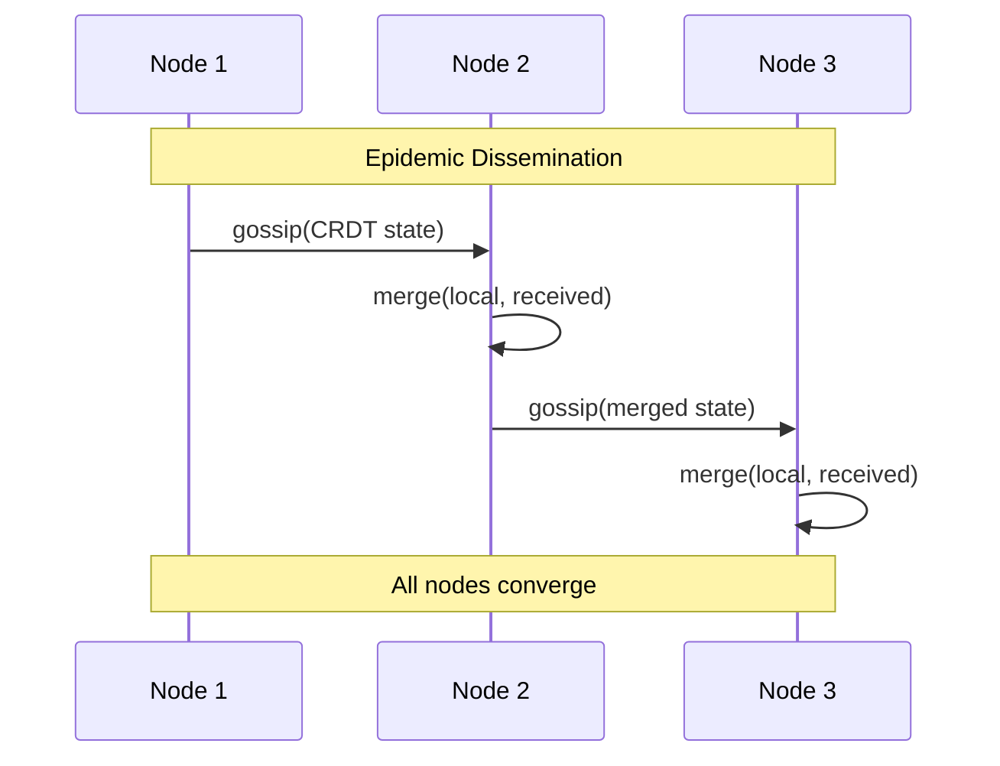

# meld

Gossip, membership, and convergence primitives for distributed systems.

Go library providing gossip transport, membership, and conflict-free replicated data types.

## Packages

| Package       | Implementations                      | Use case                                     |
| ------------- | ------------------------------------ | -------------------------------------------- |
| `gossip/`     | `udp`, `tcp`                         | Point-to-point and epidemic gossip transport |
| `membership/` | `swim`, `phi`                        | Cluster membership and failure detection     |
| `crdt/`       | `orset`, `lww`, `gcounter`, `vclock` | Conflict-free replicated data types          |

Three independent primitives. Consumers compose them in their own
binaries — no meld package imports another.

## SWIM Failure Detection

SWIM (Das et al., 2002) detects failures via probe-based protocol.
Each node periodically pings a random peer. If no ack arrives, it
requests indirect probes through other members. Binary alive/suspect/dead
decisions with configurable timeouts.

## Phi Accrual Failure Detection

Phi accrual (Hayashibara et al., 2004) outputs a continuous suspicion
level (φ) derived from heartbeat inter-arrival time statistics. The
application chooses its own threshold. Self-tuning — adapts to actual
network conditions without manual timeout configuration.

## Gossip + CRDT State Convergence

Gossip spreads state epidemically. Each node periodically sends its CRDT
state to random peers. Receivers merge and re-gossip. After O(log N)
rounds, all nodes converge with high probability. Independent of
membership — works with any peer discovery mechanism.

