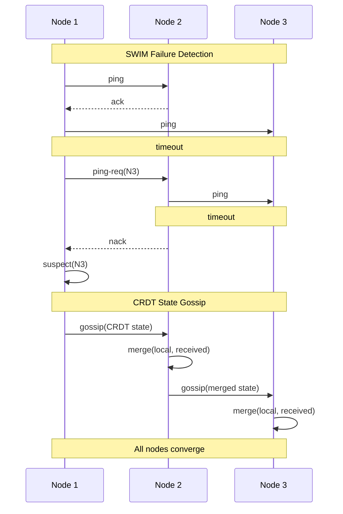

# meld

Gossip, Membership, and convergence primitives for distributed systems.

Go library providing gossip transport, membership, and conflict-free replicated data types.

## Packages

| Package       | Implementations                      | Use case                                 |
| ------------- | ------------------------------------ | ---------------------------------------- |
| `gossip/`     | `udp`, `tcp`                         | Peer-to-peer gossip transport            |
| `membership/` | `swim`, `rapid`                      | Cluster membership and failure detection |
| `crdt/`       | `orset`, `lww`, `gcounter`, `vclock` | Conflict-free replicated data types      |

## Gossip + SWIM Data Flow

