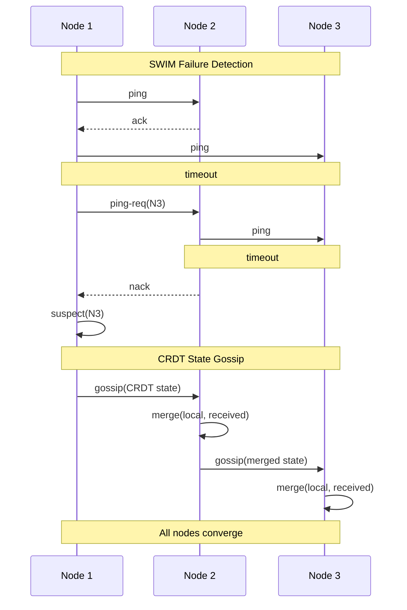
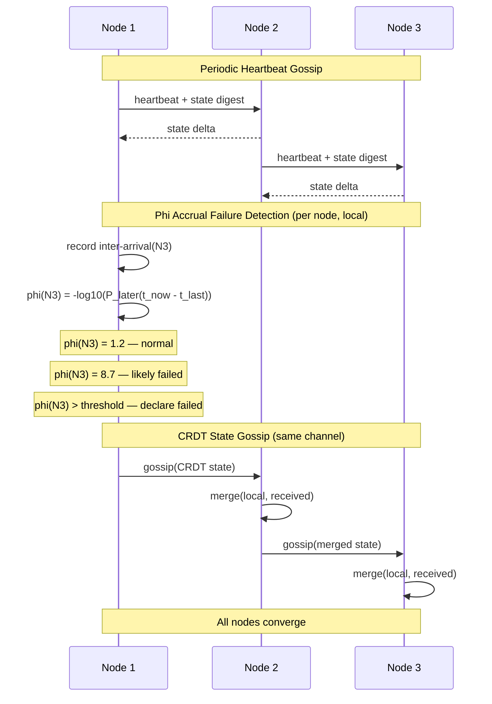

# meld

Gossip, Membership, and convergence primitives for distributed systems.

Go library providing gossip transport, membership, and conflict-free replicated data types.

## Packages

| Package       | Implementations                      | Use case                                 |
| ------------- | ------------------------------------ | ---------------------------------------- |
| `gossip/`     | `udp`, `tcp`                         | Peer-to-peer gossip transport            |
| `membership/` | `swim`, `phi`                        | Cluster membership and failure detection |
| `crdt/`       | `orset`, `lww`, `gcounter`, `vclock` | Conflict-free replicated data types      |

## Gossip + SWIM Data Flow

SWIM fuses failure detection and state dissemination into one protocol.
Probes double as gossip carriers. Binary alive/suspect/dead decisions
with manual timeout tuning.

## Gossip + Phi Accrual Data Flow

Phi accrual separates failure detection from dissemination. Heartbeat
inter-arrival times feed a statistical model that outputs a continuous
suspicion level. The application chooses its own threshold. Self-tuning.

